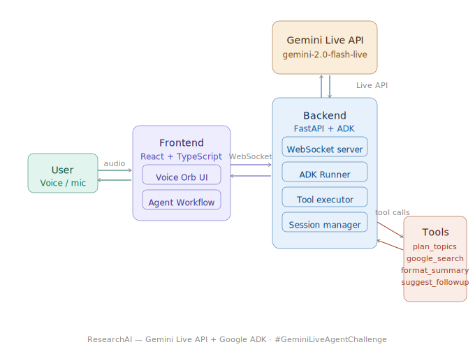

# 🎙️ ResearchAI — Voice-Powered Research Agent

> **Gemini Live Agent Challenge Submission**  
> Category: **Live Agents** 🗣️

---

## 📌 What It Does

ResearchAI is a voice-first AI research assistant powered by the **Gemini Live API**.  
Speak any research topic and the agent:

1. **Plans** — Breaks your topic into focused subtopics
2. **Searches** — Searches the live web in real time
3. **Synthesizes** — Combines findings into a clear spoken summary
4. **Follows up** — Suggests next questions to go deeper

All through **natural voice conversation** — interrupt anytime, ask follow-ups.

---

## 🏗️ Architecture

```
┌─────────────────────────────────┐
│      React + TypeScript         │
│      Voice UI (Vite)            │
│  Mic → WebSocket → Speaker      │
└────────────┬────────────────────┘
             │ WebSocket (PCM audio)
             ▼
┌─────────────────────────────────┐
│      Python + FastAPI           │
│                                 │
│  ┌───────────────────────────┐  │
│  │    Google ADK Agent       │  │
│  │  • plan_research_subtopics│  │
│  │  • google_search          │  │
│  │  • format_research_summary│  │
│  │  • suggest_followup       │  │
│  └───────────────────────────┘  │
└────────────┬────────────────────┘
             │ Gemini Live API
             ▼
┌─────────────────────────────────┐
│   gemini-2.0-flash-live-001     │
│   Google Gemini Live API        │
└─────────────────────────────────┘
```

### System Diagram



---

## 🛠️ Tech Stack

| Layer      | Technology                              |
|------------|-----------------------------------------|
| Frontend   | React 18, TypeScript, Vite, CSS Modules |
| Backend    | Python 3.12, FastAPI, WebSockets        |
| AI Agent   | Google ADK 1.26.0, Gemini Live API      |
| Voice      | gemini-2.0-flash-live-001               |
| Search     | ADK built-in google_search tool         |

---

## ✅ Hackathon Requirements Met

| Requirement              | Status |
|--------------------------|--------|
| Uses Gemini model        | ✅ gemini-2.0-flash-live-001 |
| Built with Google ADK    | ✅ Agent with 4 custom tools |
| Uses Gemini Live API     | ✅ Real-time audio streaming |
| Multimodal (audio in/out)| ✅ Voice in → Voice out |
| Real AI agent workflow   | ✅ Plan → Search → Synthesize → Respond |
| Beyond text-in/text-out  | ✅ Full voice interaction |

---

## 🚀 Running Locally

### Prerequisites
- Python 3.12+
- Node.js 18+
- Gemini API key from [aistudio.google.com](https://aistudio.google.com)

### Backend

```bash
cd backend

python -m venv .venv
source .venv/Scripts/activate   # Windows Git Bash
# source .venv/bin/activate     # Mac/Linux

pip install -r requirements.txt

cp .env.example .env
# Edit .env → add your GOOGLE_API_KEY

cd app
uvicorn main:app --reload --port 8000
```

### Frontend

```bash
cd frontend

npm install

cp .env.example .env
# Edit .env → VITE_WS_URL=ws://localhost:8000

npm run dev
```

Open **http://localhost:5173**, click **Connect**, then click the orb and start talking.

---

## 📁 Project Structure

```
ai-research-agent/
├── backend/
│   ├── app/
│   │   ├── main.py                  # FastAPI + WebSocket server
│   │   ├── tools.py                 # Custom ADK research tools
│   │   └── research_agent/
│   │       └── agent.py             # ADK Agent definition
│   ├── requirements.txt
│   ├── Dockerfile
│   └── .env.example
├── frontend/
│   ├── src/
│   │   ├── components/
│   │   │   ├── VoiceOrb.tsx
│   │   │   ├── StatusBar.tsx
│   │   │   ├── TranscriptPanel.tsx
│   │   │   ├── ConversationHistory.tsx
│   │   │   ├── AgentSteps.tsx
│   │   │   └── StarfieldCanvas.tsx
│   │   ├── hooks/
│   │   │   ├── useVoiceAgent.ts
│   │   │   └── useAudioPlayer.ts
│   │   └── types/index.ts
│   └── package.json
└── README.md
```

---

## 👤 Author

Built for the **Gemini Live Agent Challenge** — Google × Devpost, 2026.  
`#GeminiLiveAgentChallenge`